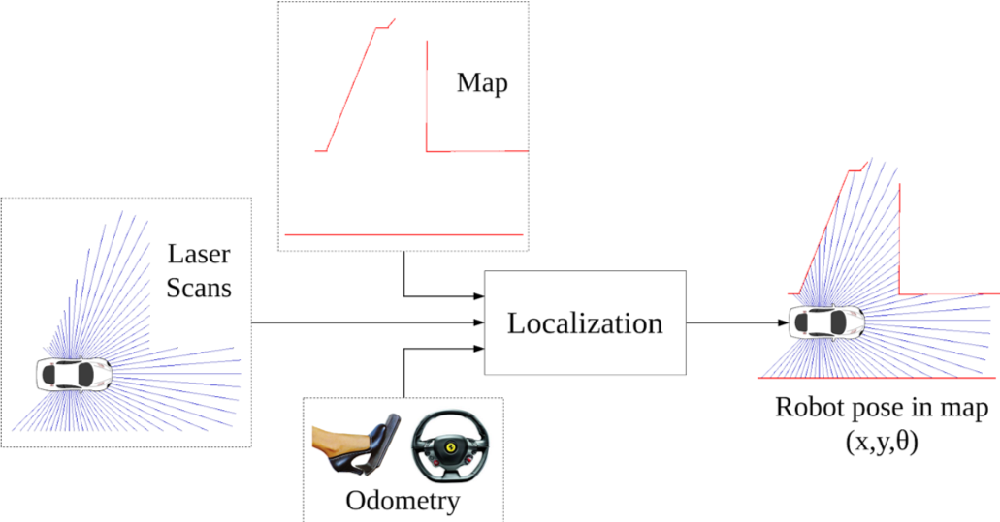

| Deliverable | Due Date              |
|---------------|----------------------------------------------------------------------------|
| Briefing (8 min presentation + 3 min Q&A) (slides on [github pages](https://github.mit.edu/rss/website2021))  | Wednesday, April 14th at 1:00PM EST |
| Report (on [team github pages website](https://github.mit.edu/rss/website2021)) | Friday, April 16th at 11:59PM EST |
| Pushed code | Friday, April 16th at 11:59PM EST |
| [Team Member Assessment](https://docs.google.com/forms/d/e/1FAIpQLScM6T3JsnlFQldhL_fVmAr9FkUILOjbXHM_nYxK280UZwJPww/viewform)  | Friday, April 16th at 11:59PM EST |

**TODO double check due dates**
**TODO is team member assessment link same for each lab? also check in submission / grading section below**

# Lab 5: Monte Carlo Localization (MCL)

## Introduction

Determining a robot’s orientation and position in a known environment, also known as localization, is a critical problem in the field of robotics. As is common in robotics, this seemingly simple problem is surprisingly difficult, and remains an active research area. In this lab, you will solve robotic localization by implementing Monte Carlo Localization (aka MCL or particle filter). This is a challenging lab and we'd recommend starting early and moving fast.

This lab consists of a number of modules, some required and some extra credit, some individual and some with your team - for details on submission, grading, and deliverables, see the next section. For more detailed instructions on each module see [this notebook](README.ipynb) (may need to open in Chrome or Firefox to avoid incorrect equation rendering in Safari).

## Submission and Grading

The deliverables for this lab consist of five parts (two of which are optional) for a total of 10 points with 2 possible extra credit points. Parts A and E must be submitted individually, while the rest are teamwork. There will also be a report and briefing for this lab, and each teammate must submit the [team member assessment form](https://docs.google.com/forms/d/e/1FAIpQLScM6T3JsnlFQldhL_fVmAr9FkUILOjbXHM_nYxK280UZwJPww/viewform).

**TODO: right weights? add rubric links**
Parts A, B, and C are required and will be graded out of 10 points. This grade out of 10 points is then combined with the report and briefing grades (each also out of 10 points - see rubrics [here]() and [here]()). The grade for the modules is weighted at 0.4, the report at 0.4, and the briefing at 0.2, for an overall lab 5 grade out of 10 points. *Note that due to the individual nature of parts A and E, overall lab grades may differ across teammates.*

-   **Part A - (Writing Assignment)** Understand the motion and sensor model.
-   **Part B - (Programming Assignment)** Develop and test the particle filter algorithm in 2D racecar simulation environment, upload solution to gradescope for autograder evaluation.
-   **Part C - (Localization in TESSE)** Adapt your solution from part B to work in TESSE and conduct experimental analysis for your report and briefing.
-   *Part D - (OPTIONAL: Extra Credit) From localization to SLAM: configure and run Google Cartographer in the simulator.*
-   *Part E - (OPTIONAL: Extra Credit) Derive the Bayes' Filter presented in Lecture 10.*

### Part A: Writing assignment (3 points) - **INDIVIDUAL EFFORT**, *REQUIRED*

Submit your answers **INDIVIDUALLY** to the writing assignment on **gradescope**, preferably LaTeXed. You must show work (derivations, formulas used, etc.) to receive full credit. You may collaborate on problems but you cannot simply share answers. You must write up your solutions independently.

The 3 points of part A will be assigned based on the submitted written exercises.
- 1 point for part (i) in question 1
- 1 point for part (ii) in question 1
- 1 point for question 2

**TODO: make sure gradescope assignment names match**
Work on the questions and submit your numeric answers along with your justifications to the Gradescope assignment **Lab 5 Part A: Individual Submission**. You may check your numeric results by putting your answers in `solutions_go_here.py` and uploading to the Gradescope autograder **Lab 5 Part A: OPTIONAL**, but your grade will be based only on your explanations and answers submitted for the written portion. Just writing the final answer will not give total credit, even if correct. These questions will help you understand the algorithm before diving into coding.

### Part B: Programming implementation and autograder (3 points) - **TEAMWORK**, *REQUIRED*

Implement MCL in the simulator. Augment the simulated odometry data with various types of noise and compare how your solution does compared to the ground truth odometry. Run your implementation of MCL on the gradescope autograder. Points will be assigned based on performance as compared to the TA solution in the 2D racecar simulation environment. See the section 5 of part B in the [instructions notebook](README.ipynb) for more details on how exactly the autograder will evaluate your implementation.

**Note that while the autograder will add noise to the odometry when evaluating your solution, you must augment the odometry with your own noise when using the 2D simulation environment, both in order to increase your confidence in your solution and to evaluate your implementation in a realistic environment when providing analysis in your report and briefing.**

### Part C: Localization in TESSE (4 points) - **TEAMWORK**, *REQUIRED*

For this part you will need to adapt your MCL implementation from part B to work in TESSE, and conduct experimental analysis of your algorithm's performance for your report and briefing. See part C of the [instructions notebook](README.ipynb) for more details on how to adapt your code to run in TESSE.

In your report and briefing, make sure to provide
- Numerical evidence that your algorithm is working in the form of charts / data
    - Convergence rates, cross track error, etc
    - Show how the robust the simulator is in the presence of **noisy odometry** (augmenting `/odom` with noise for 2D simulation environment, `/tesse/odom/noisy` for TESSE), using **ground truth odometry** for comparison (`/odom` for 2D simulation environment, `/tesse/odom` for TESSE)

- An [illustrative video](https://www.youtube.com/watch?v=-c_0hSjgLYw&t=6s) of your particle filter working, overlaying
    - Visualization of inferred position
    - Visualization of the particle distribution
    - The known map
    - Laser scan data in the coordinate frame of your inferred position (it should align fairly well with the walls in the known map)
    - Any other byproducts of your algorithm which you find worthy of visualization

### Part D: SLAM with Google Cartographer (1 bonus point) - **TEAMWORK**, *OPTIONAL EXTRA-CREDIT*

Experiment with SLAM by configuring and running Google Cartographer in the simulation evnironment. Include your results in your lab report and presentation.

- Build a map of the Bldg 31 OR STATA basement using Cartographer (these are the usual provided maps)
- Localize using Cartographer
- Show visualization evidence that Cartographer is working in the simulator

### Part E (1 bonus point) - **INDIVIDUAL EFFORT**, *OPTIONAL EXTRA-CREDIT*

Derive the form of the Bayes' Filter presented in Lecture 10. Submit as a typed PDF uploaded to Gradescope.
